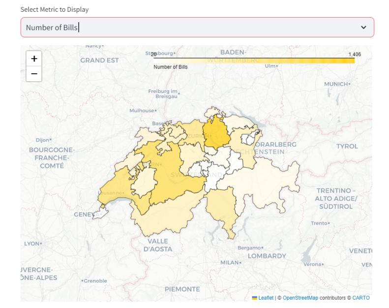
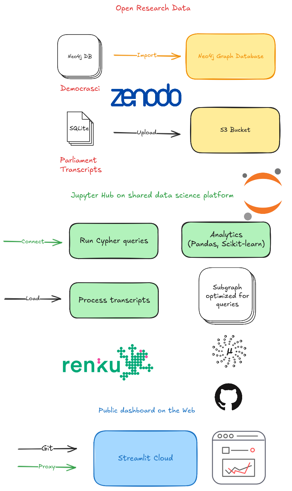

Exploring and visualizing regional politics in Switzerland
---

_“Kümmern Sie sich um meine Region? Bien sûr, la tua e tutte le altre, ed da tut la Svizra”_

Created for Challenge 5.2 at the [SDSC Hackathon](https://sdsc-hackathons.ch/) on October 24-25, 2024

- Team: [Simon](https://swisscatplus.ethz.ch/people.html), [Adrien](https://ch.linkedin.com/in/adrien-simard-3699a31ba), [Steven](https://github.com/fluchairesteven), [Nejma](https://www.linkedin.com/in/nebr/), [Oleg](https://loleg.github.io/)
- Expert: [Luis Salamanca](https://www.datascience.ch/people/luis-salamanca)
- Presentation: [Slides on HackMD](https://hackmd.io/@oleg/rk_1gAuxyx#/)

# Challenge

To improve understanding of **Swiss parliamentary decisions** using **Open Research Data** & shared platforms for **Data Science**.

# Solution

We worked as a team to obtain, explore and visualize the data. Our main collaboration tools were the Renku platform, with Neo4j for data exploration and Streamlit for data visualization. We also used GitHub and Discord. The OpenAI and Cohere GPT systems were used for code assistance. We also used HackMD and Excalidraw for this presentation.

Our project is designer to run on the [Renku v2 platform](https://renku.io), but you can preview our result notebooks here:

- [data_structuration_for_use_cases.ipynb](data_structuration_and_views/data_structuration_for_use_cases.ipynb)

### 1. Data collection and access

_A graph-based information extraction pipeline_

The data from Swiss parliamentary APIs was extracted by the DemocraSci team and utilized to build a knowledge graph, creating a powerful resource for understanding the complex relationships between parliamentary entities. 


Neo4j, a leading graph database, is used to model and query these relationships efficiently. The knowledge graph captures connections between politicians, parties, bills, and regions, enabling us to analyze and visualize the impact of decisions on a regional level.

A copy of this database has been published on Zenodo, and imported into an S3 bucket for processing at the hackathon. Neo4j was deployed to a server, and accessed from Jupyter Hub using the [Neo4j Python Driver](https://neo4j.com/docs/python-manual/current/)

See https://zenodo.org/records/13920293

### 2. Impact Analysis

By leveraging the Cypher query language, we extract relevant metadata, including topics, entities, and relationships. A detailed data schema is available online from the DemocraSci project.


This pipeline forms the foundation for our knowledge graph, providing a structured representation of parliamentary data. From this, queries can be written that are explored using visual graph representations and text summaries. 

Find links used to develop this in [PROJECT.md](PROJECT.md)

### 3. Streamlit dashboard

Interactive visualizations, such as maps and charts, provide a clear understanding of how different regions are affected by specific bills and policies. To make our findings accessible and engaging, we started to develop a dashboard or web application for visualization. This tool allows users to explore the enriched knowledge graph, gaining valuable insights into the impact of parliamentary decisions. 

Our Exploration Dashboard was developed in Python using the [Streamlit](https://streamlit.io/) framework for Python. It has an easy to use navigation, showing a range of maps and charts - currently this includes a Cantons Overview, Evolutions of Topics over time, and Gender Representation.



To run the dashboard:

```bash
pip install requirements.txt
cd streamlit_app
streamlit run Presentation.py
```

### 4. Reusability and Next Steps

All the components of the project are open source and reusable, and we have endeavored to keep the project lightweight and repeatable. Please contact us via [GitHub Issues](https://github.com/fluchairesteven/hackathon-24-lagginhorn2/issues) if you see omissions or experience problems.



The next steps are to make it possible to use various filters and chart types in the dashboard. We would also like to leverage natural language input for interacting with the user.

We believe that our project has the potential to shape future research and policy-making, ultimately leading to more effective and responsive governance in Switzerland.

Thanks kindly to all the team members, as well as our fellow participants, coaches and organizers at the hackathon for the support `<3` 

# License

This project is open access under the [CC0 Universal 1.0](LICENSE) license.

